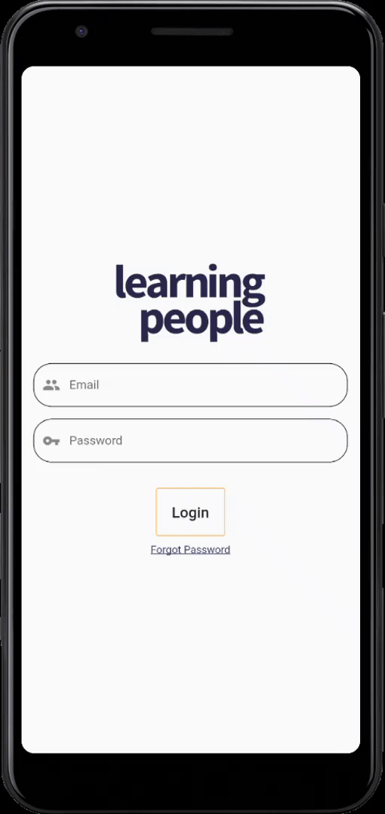
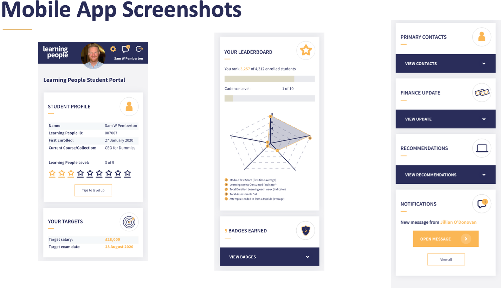

# Learning Flutter

### Installations
- Install [Flutter][https://flutter.dev/docs/get-started/install]
- Install Android Studio
- Run 'flutter doctor -v' to check whether flutter installation is successful or not
- Run 'flutter pub get' to download all librariess

### Snapshots
# Screenshots

|                                    |                                        |
| :--------------------------------: | :------------------------------------: |
|  | |
|          |    |